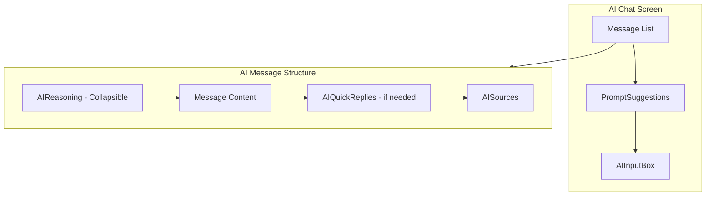
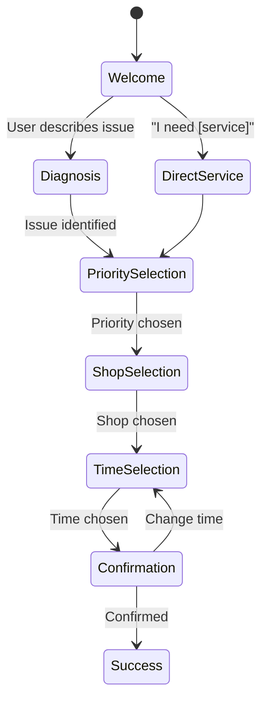

# AI Chat MVP Revamp

## Overview

Revamp the AI chat UI with custom React Native components inspired by prompt-kit. Create a familiar ChatGPT-style experience with:

- **Stage-aware suggestions** that change based on conversation flow (clickable for MVP demo)
- **Visible reasoning steps** showing the diagnostic process
- **Context-dependent sources** (Smartcar API, Error Codes, Service History)

## Design System (Match Existing App)

From home screen and onboarding:

- **Background:** `#E8ECF0` / `#dde2ee` (soft gray)
- **Primary:** `#141C24` (dark navy text)
- **Accent:** `#5299FE` (blue - buttons, highlights)
- **Cards:** White (`#FFFFFF`) with subtle shadows
- **Border Radius:** 16px for cards, full for pills
- **Font:** Urbanist family
- **Shadows:** `Shadows.sm` from theme

## Phase 1: Core UI Components

### Component Architecture



### 1. PromptSuggestions Component

**Create:** `components/ai-chat/PromptSuggestions.tsx`

**Key Feature:** Suggestions change based on current conversation stage

**Welcome Stage:**

```
[ My brakes are squeaking ]  [ I need an oil change ]
[ Check engine light is on ] [ Something feels off ]
```

**Priority Selection Stage:**

```
[ Closest ]  [ Best rated ]  [ Best price ]
```

**Shop Selection Stage:**

```
[ Quick Lube Express ]  [ Euro Auto Care ]  [ Joe's Auto ]
```

**Time Selection Stage:**

```
[ Tomorrow 9:00 AM ]  [ Tomorrow 11:30 AM ]  [ Thursday 10:00 AM ]
```

**Confirmation Stage:**

```
[ Yes, book it ]  [ Change time ]  [ Cancel ]
```

Features:

- Pill-shaped buttons with subtle border (prompt-kit style)
- Located **above the input box**
- Changes dynamically based on `currentStage` from store
- Press animation with scale effect
- Horizontal scroll when many options

### 2. AIReasoning Component

**Create:** `components/ai-chat/AIReasoning.tsx`

Collapsible "Thinking..." section with animated step reveal:

**While Processing:**

```
Thinking...  ● ● ●
```

**After Complete (Expanded):**

```
▼ Show reasoning
  ✓ Step 1: Checking Smartcar API for error codes...
  ✓ Step 2: Found brake pad warning in vehicle data
  ✓ Step 3: Checking Service History - last brake service: 18 months ago
  ✓ Step 4: Cross-referencing Common Scenarios DB...
```

Features:

- "Thinking..." with animated bouncing dots during `isStreaming`
- Steps appear one-by-one with checkmark animation
- Chevron toggle (▼/▲) to expand/collapse
- Auto-collapse when response complete
- Steps are scenario-specific (shows we're "doing something")

### 3. AISources Component

**Create:** `components/ai-chat/AISources.tsx`

**Context-Dependent Sources** - only show relevant ones per scenario:

**Brake Noise Sources:**

```
[🚗] Smartcar API   [🕐] Service History   [📋] Common Scenarios
```

- Smartcar: Check if error codes show brake pad warning
- Service History: When were brakes last serviced?
- Common Scenarios: Pattern matching for squeal symptoms

**Check Engine Light Sources:**

```
[🚗] Smartcar API   [📖] Error Codes   [📋] Common Scenarios
```

- Smartcar: Read the actual error code (P0171)
- Error Codes: Dictionary lookup for code meaning
- Common Scenarios: Known causes for that code

**Oil Change Sources:**

```
[🚗] Smartcar API   [🕐] Service History
```

- Smartcar: Current oil life percentage
- Service History: Preferred shops from past visits

Features:

- Small pill with emoji icon + label
- Horizontal row at bottom of AI message
- Tap to show tooltip with description
- Only relevant sources shown (not all 4 every time)

### 4. AIQuickReplies Component

**Create:** `components/ai-chat/AIQuickReplies.tsx`

**Different style from suggestions** - more prominent for in-conversation choices:

```
┌─────────────┐  ┌─────────────┐  ┌─────────────┐
│   Closest   │  │ Best rated  │  │ Best price  │
└─────────────┘  └─────────────┘  └─────────────┘
```

Features:

- Larger buttons than pill suggestions
- Blue accent background or border
- Used for priority selection, yes/no confirmations
- Appears inline within the conversation (not above input)

### 5. Enhanced AIInputBox

**Enhance:** [`components/ai-chat/AIInputBox.tsx`](components/ai-chat/AIInputBox.tsx)

Changes:

- Auto-expanding textarea (grows with content, max 4 lines)
- Cleaner design matching prompt-kit aesthetic
- Placeholder: "Type a message or click a suggestion..."
- Send button: Circular, blue when active, gray when empty
- Remove camera/voice buttons for MVP (simplify)
- Add subtle shadow to match home screen cards

### 6. Enhanced AIMessageBubble

**Enhance:** [`components/ai-chat/AIMessageBubble.tsx`](components/ai-chat/AIMessageBubble.tsx)

Structure for AI messages:

```
┌─────────────────────────────────┐
│ ▼ Show reasoning                │  <- AIReasoning (collapsible)
│   Step 1: Checking Smartcar...  │
│   Step 2: Found P0171 code...   │
├─────────────────────────────────┤
│ I see your check engine light   │  <- Main message content
│ is on. Let me scan for codes... │
│                                 │
│ ┌─────────┐ ┌─────────┐        │  <- AIQuickReplies (if needed)
│ │ Closest │ │ Best $  │        │
│ └─────────┘ └─────────┘        │
├─────────────────────────────────┤
│ [🚗] Smartcar  [📖] Error Codes │  <- AISources
└─────────────────────────────────┘
```

Features:

- Integrate AIReasoning at top (for AI messages only)
- Integrate AISources at bottom
- Streaming text animation (words appear progressively)
- Support for structured content (bullet lists)

## Phase 2: Scenario Engine

### Conversation State Machine



### Reasoning Steps by Scenario

**Brake Noise:**

```
Step 1: Checking Smartcar API for brake system warnings...
Step 2: Checking Service History - last brake service date...
Step 3: Analyzing symptom: "high-pitched squeal"
Step 4: Matching pattern in Common Scenarios DB...
Result: Wear indicator suggests brake pads are low
```

**Check Engine Light:**

```
Step 1: Scanning Smartcar API for error codes...
Step 2: Found code P0171 - looking up in Error Code Dictionary...
Step 3: P0171 = "System Too Lean - Bank 1"
Step 4: Common causes: vacuum leak, MAF sensor, air filter
Result: Professional diagnostic scan recommended
```

**Oil Change:**

```
Step 1: Checking Smartcar API for oil life percentage...
Step 2: Oil life at 12% - approximately 500 miles remaining
Step 3: Checking Service History for preferred shops...
Result: Ready to schedule with nearby shops
```

**Tire Pressure:**

```
Step 1: Reading Smartcar API tire pressure data...
Step 2: Front left tire at 24 PSI (8 below normal)
Step 3: Checking for recent temperature changes...
Result: Could be slow leak or cold weather - inspection recommended
```

### MVP Scenarios (6 total from Database.pdf)

| # | Scenario | Trigger | Stages |

|---|----------|---------|--------|

| 1 | Oil Change | "oil", proactive alert | Priority → Shop → Time → Confirm |

| 2 | Brake Noise | "brake", "squeak" | Scan → Question → Priority → Shop → Time → Confirm |

| 3 | Check Engine | "check engine", "CEL" | Scan → Explain → Priority → Shop → Time → Confirm |

| 4 | Tire Pressure | "tire", "pressure" | Scan → Options → Shop → Time → Confirm |

| 5 | Vague Issue | "something wrong" | Questions → Inspection → Priority → Shop → Time → Confirm |

| 6 | Direct Booking | "I need [service]" | Priority → Shop → Time → Confirm |

## Files to Create/Modify

### New Files (Phase 1 - UI)

- `components/ai-chat/PromptSuggestions.tsx` - Stage-aware suggestion pills
- `components/ai-chat/AIReasoning.tsx` - Collapsible thinking/steps
- `components/ai-chat/AISources.tsx` - Context-dependent source pills
- `components/ai-chat/AIQuickReplies.tsx` - Prominent reply buttons

### New Files (Phase 2 - Logic)

- `services/ai/scenarioEngine.ts` - State machine + pattern matching
- `services/ai/scenarios.ts` - All 6 scenarios with suggestions per stage
- `services/ai/types.ts` - Response types, stage types, source types

### Modified Files

- `components/ai-chat/AIInputBox.tsx` - Cleaner, auto-expanding
- `components/ai-chat/AIMessageBubble.tsx` - Integrate Reasoning + Sources
- `components/ai-chat/AITypingIndicator.tsx` - Better "Thinking..." animation
- `components/ai-chat/index.ts` - Export new components
- `app/(main-tabs)/ai-chat/index.tsx` - Wire up new components
- `stores/useAIChatStore.ts` - Add stage tracking, remove HuggingFace

### Files to Remove (After Phase 2)

- `services/api/huggingface.ts`
- `services/api/aiChat.ts`
- `services/config/ai.config.ts`
