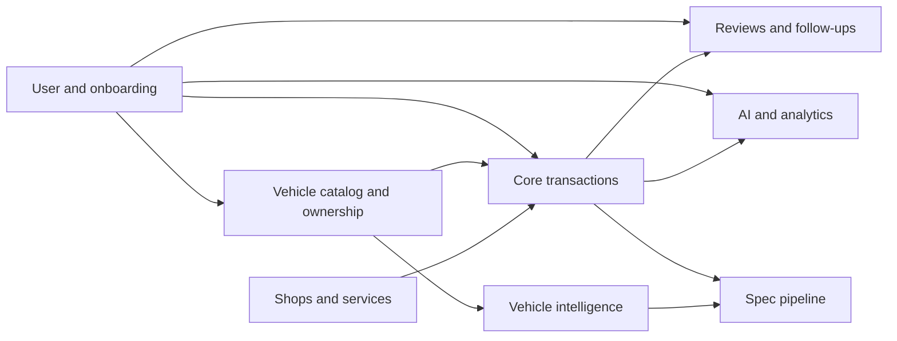
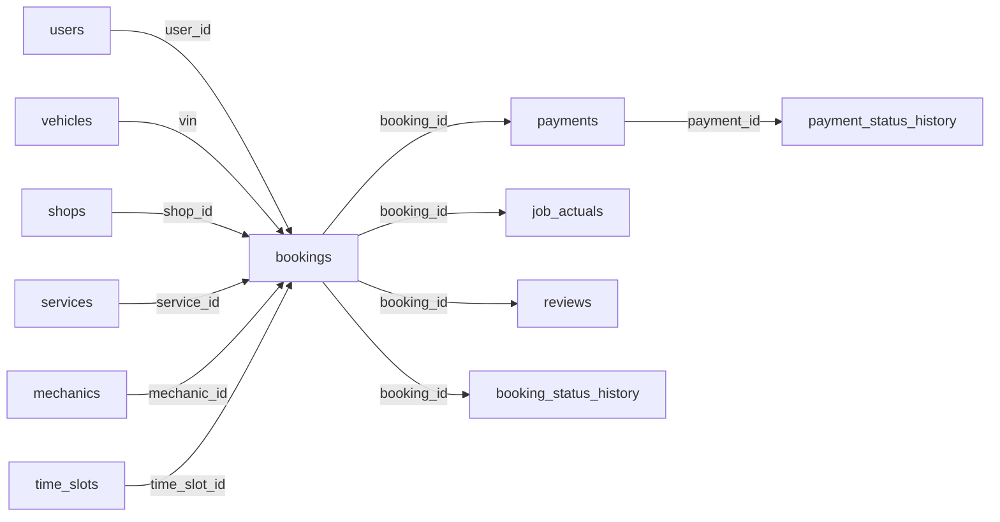
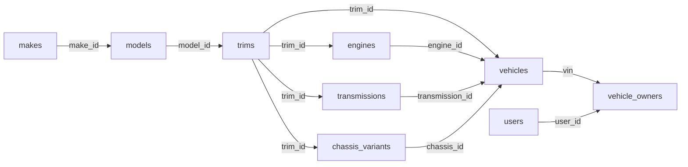
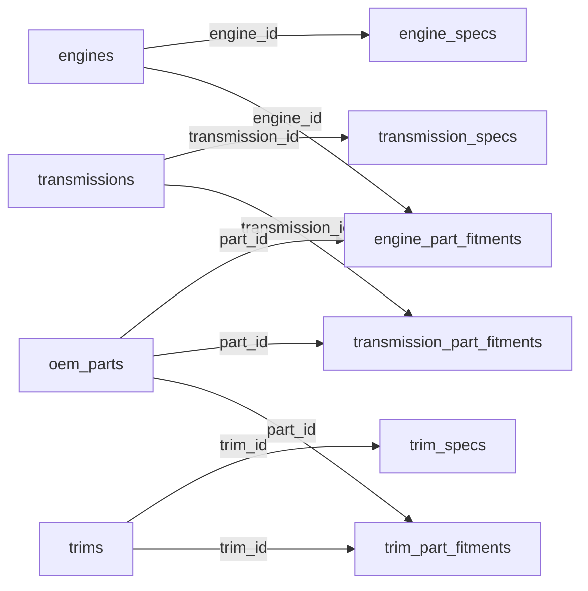
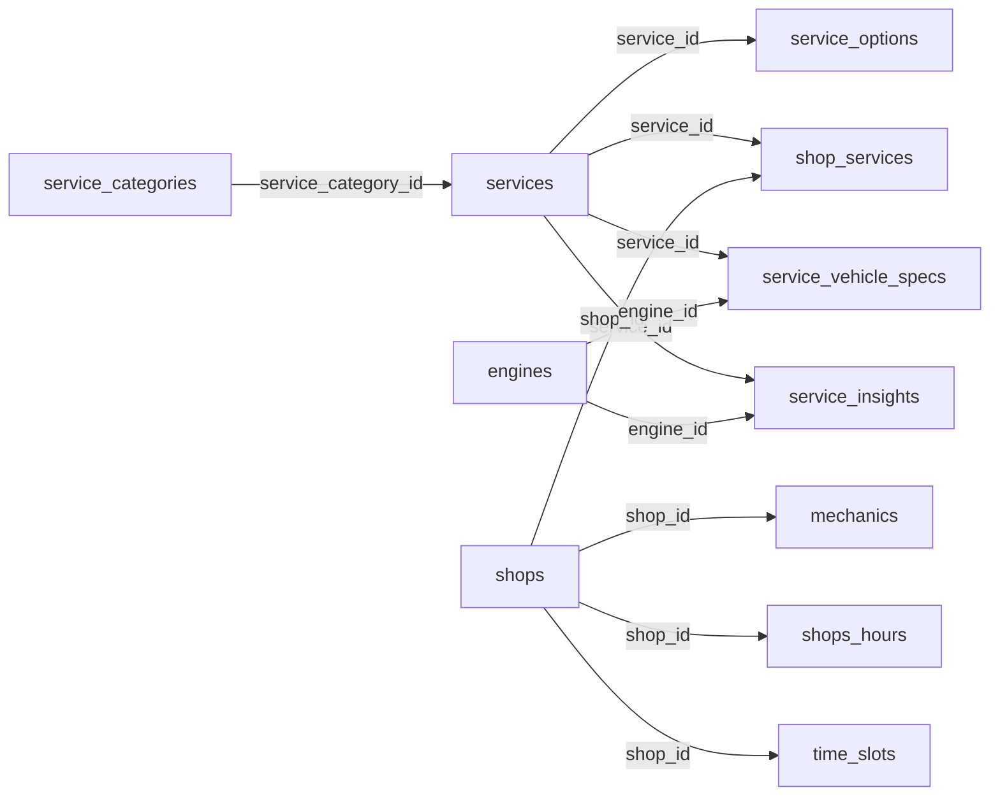
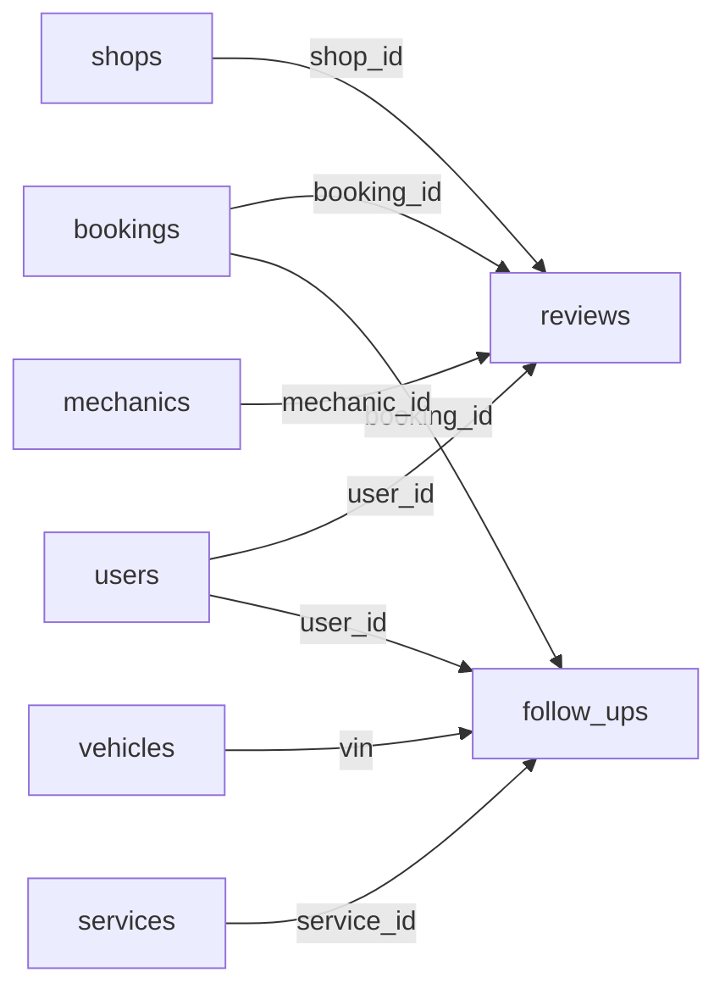
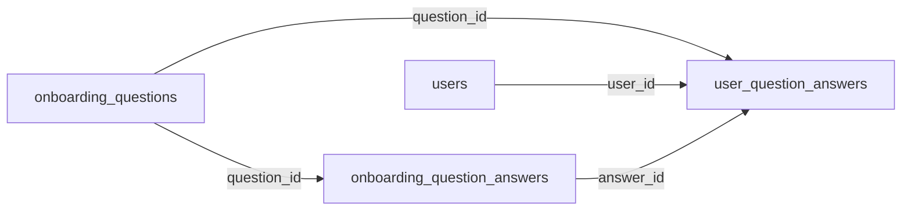
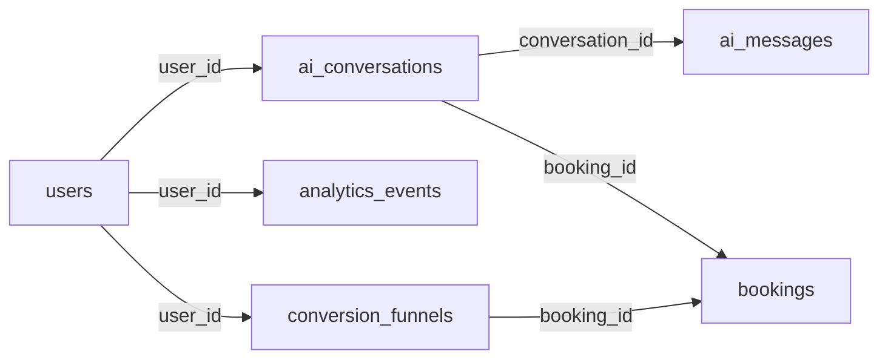
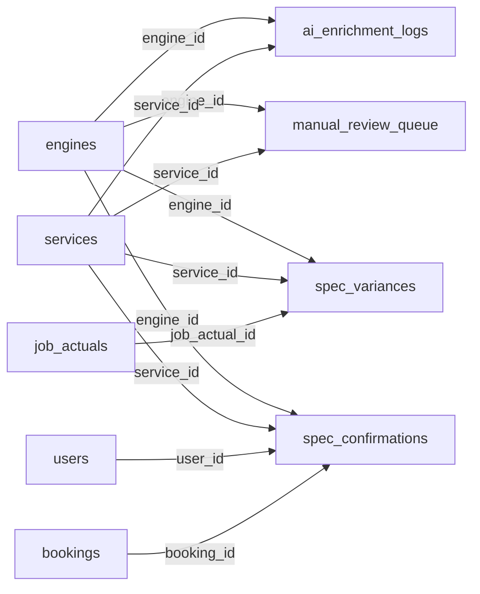

# OtoPair Database Diagrams

Diagrams reflect the current Convex schema ([convex/schema.ts](convex/schema.ts)) — 44 tables, broken into **one high-level view** and **one detailed diagram per part**.

**How to view:** Open **Markdown preview** (`Ctrl+Shift+V` or right‑click → **Open Preview**). Use **Ctrl+Shift+P** → **"Markdown: Open Preview to the Side"** if diagrams don’t render.

---

## High-level: database in 8 parts

| Part | Tables |
|------|--------|
| **1. Core transactions** | bookings, payments, job_actuals, booking_status_history, payment_status_history |
| **2. Vehicle catalog and ownership** | makes, models, trims, engines, transmissions, chassis_variants, vehicles, vehicle_owners |
| **3. Vehicle intelligence** | engine_specs, transmission_specs, trim_specs, oem_parts, engine_part_fitments, transmission_part_fitments, trim_part_fitments |
| **4. Shops and services** | shops, mechanics, services, service_categories, service_options, shop_services, shops_hours, time_slots, service_vehicle_specs, service_insights |
| **5. Reviews and follow-ups** | reviews, follow_ups |
| **6. User and onboarding** | users, user_question_answers, onboarding_questions, onboarding_question_answers |
| **7. AI and analytics** | ai_conversations, ai_messages, analytics_events, conversion_funnels |
| **8. Spec pipeline** | ai_enrichment_logs, manual_review_queue, spec_variances, spec_confirmations |

---

## Part 1: Core transactions

---

## Part 2: Vehicle catalog and ownership

---

## Part 3: Vehicle intelligence (specs and fitments)

---

## Part 4: Shops and services

---

## Part 5: Reviews and follow-ups

---

## Part 6: User and onboarding

---

## Part 7: AI and analytics

---

## Part 8: Spec pipeline

---

*Source: [convex/schema.ts](convex/schema.ts).*
