# Database Diagrams

Mermaid diagrams for the OtoPair Convex schema — **single source** for all database diagrams. Source: [convex/schema.ts](../convex/schema.ts) (44 tables).

**How to view:** Open Markdown preview (`Ctrl+Shift+V` or right‑click → **Open Preview**). Use **Ctrl+Shift+P** → **"Markdown: Open Preview to the Side"** if diagrams don't render. Diagrams render in VS Code / Cursor and on GitHub.

---

## Overview

Three levels of detail:

| Level       | Scope             | Contents                                                                                                  |
| ----------- | ----------------- | --------------------------------------------------------------------------------------------------------- |
| **1. High** | Whole DB          | One diagram: 8 domain groups and how they connect.                                                        |
| **2. Mid**  | Per domain        | One diagram per part (8 parts): tables and FKs within that domain.                                        |
| **3. Low**  | Per table + flows | **One diagram per table** (field-level, legible); then function flow diagrams (Convex queries/mutations). |

---

## Level 1: High-level — database in 8 parts

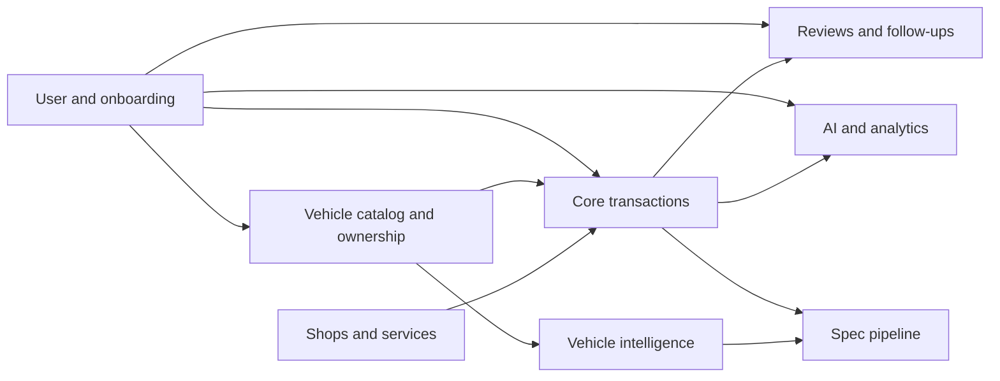

| Part                                 | Tables                                                                                                                                           |
| ------------------------------------ | ------------------------------------------------------------------------------------------------------------------------------------------------ |
| **1. Core transactions**             | bookings, payments, job_actuals, booking_status_history, payment_status_history                                                                  |
| **2. Vehicle catalog and ownership** | makes, models, trims, engines, transmissions, chassis_variants, vehicles, vehicle_owners                                                         |
| **3. Vehicle intelligence**          | engine_specs, transmission_specs, trim_specs, vehicle_specs, oem_parts, engine_part_fitments, transmission_part_fitments, trim_part_fitments     |
| **4. Shops and services**            | shops, mechanics, services, service_categories, service_options, shop_services, shops_hours, time_slots, service_vehicle_specs, service_insights, cdn_assets, shop_portfolio |
| **5. Reviews and follow-ups**        | reviews, follow_ups                                                                                                                              |
| **6. User and onboarding**           | users, user_question_answers, onboarding_questions, onboarding_question_answers                                                                  |
| **7. AI and analytics**              | ai_conversations, ai_messages, analytics_events, conversion_funnels                                                                              |
| **8. Spec pipeline**                 | ai_enrichment_logs, manual_review_queue, spec_variances, spec_confirmations                                                                      |

---

## Level 2: Mid-level — tables and relationships by part

### Part 1: Core transactions

```mermaid
flowchart LR
  users[users]
  vehicles[vehicles]
  shops[shops]
  services[services]
  mechanics[mechanics]
  time_slots[time_slots]
  bookings[bookings]
  payments[payments]
  job_actuals[job_actuals]
  reviews[reviews]
  booking_hist[booking_status_history]
  payment_hist[payment_status_history]

  users -->|user_id| bookings
  vehicles -->|vin| bookings
  shops -->|shop_id| bookings
  bookings -->|service_ids[]| services
  mechanics -->|mechanic_id| bookings
  time_slots -->|time_slot_id| bookings
  bookings -->|booking_id| payments
  bookings -->|booking_id| job_actuals
  bookings -->|booking_id| reviews
  bookings -->|booking_id| booking_hist
  payments -->|payment_id| payment_hist
```

---

### Part 2: Vehicle catalog and ownership

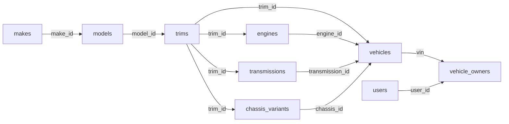

---

### Part 3: Vehicle intelligence (specs and fitments)

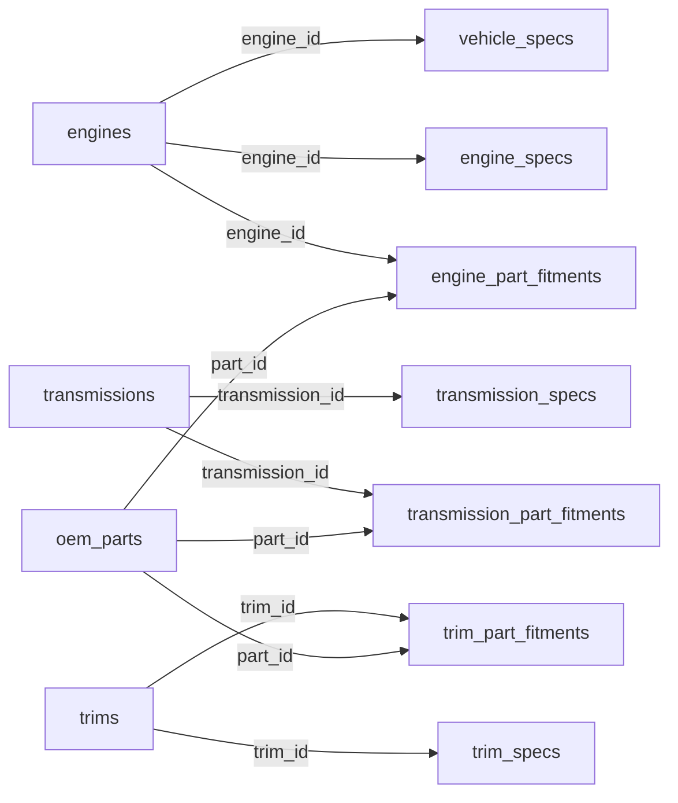

---

### Part 4: Shops and services

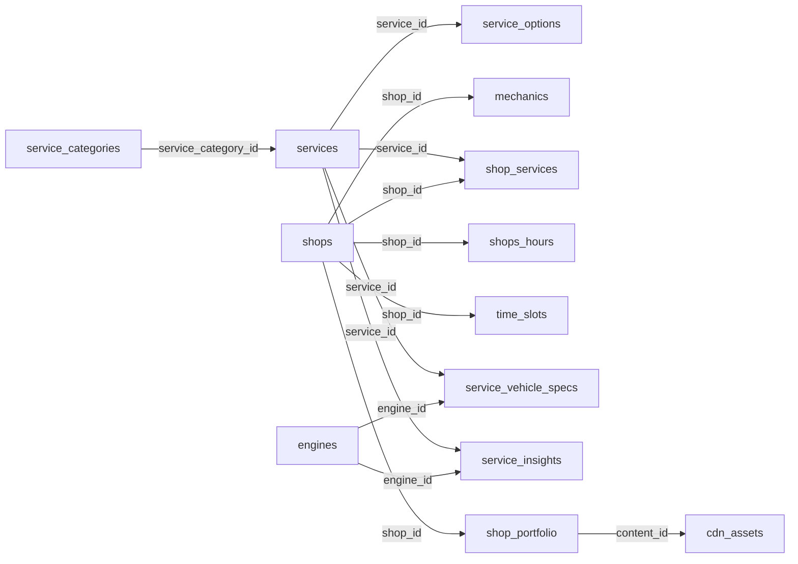

---

### Part 5: Reviews and follow-ups

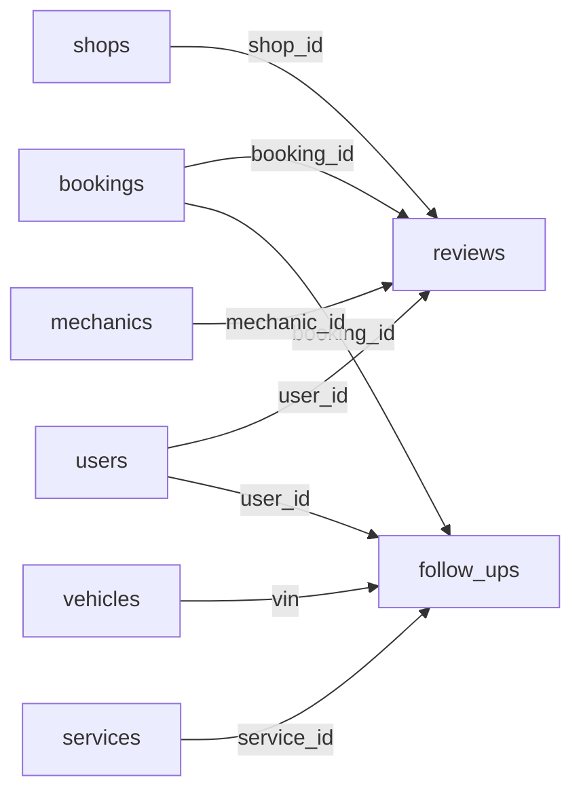

---

### Part 6: User and onboarding

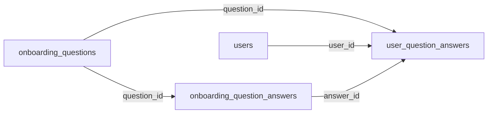

---

## Part 7: AI and analytics

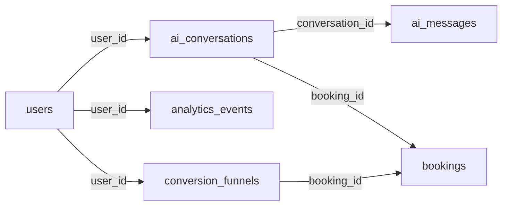

---

### Part 8: Spec pipeline

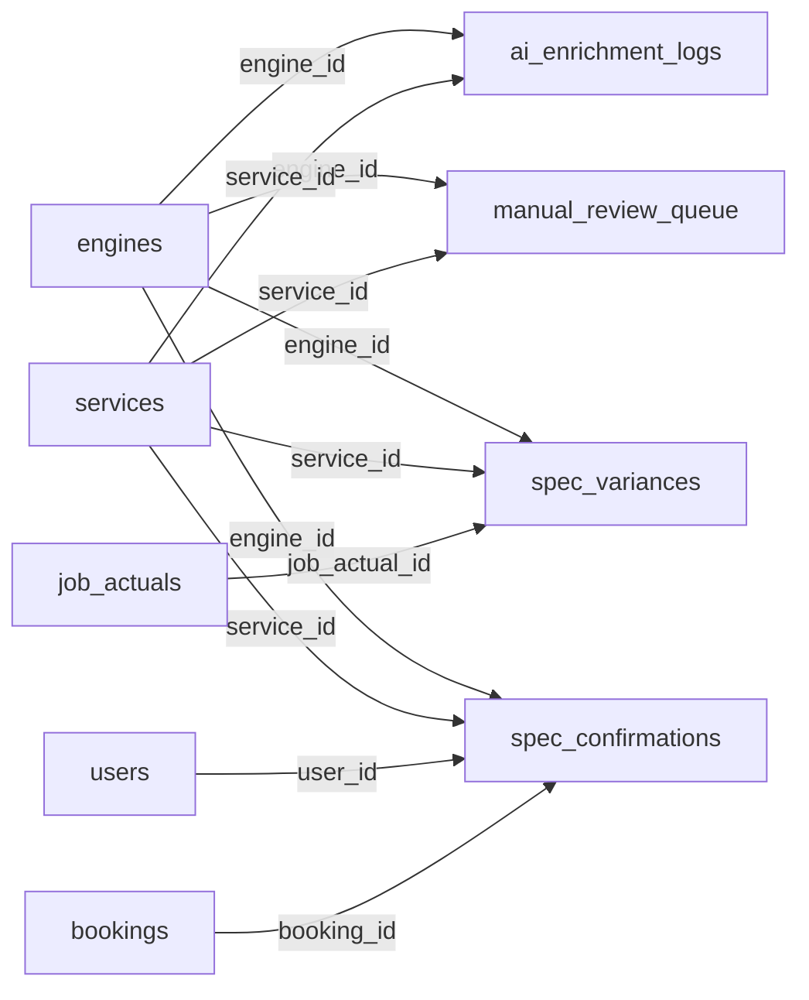

---

## Level 3: Low-level — table fields and function flows

Level 3 adds (1) per-table field and index definitions and (2) diagrams of Convex function flows (queries/mutations).

---

### Level 3 — Part 1: Core transactions (one table per diagram)

#### Table: `bookings`

One row per appointment. Multiple services are stored in the `service_ids` array; costs and time are aggregated on the row.

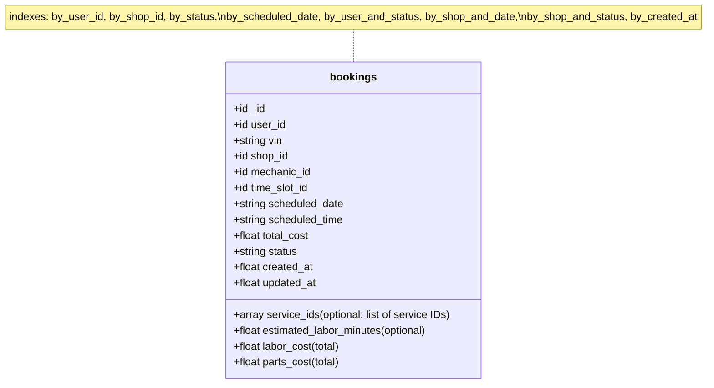

#### Table: `payments`

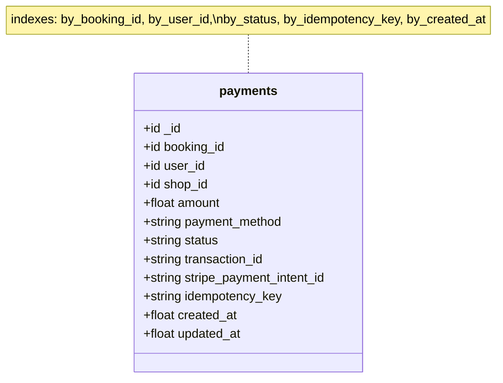

#### Table: `job_actuals`

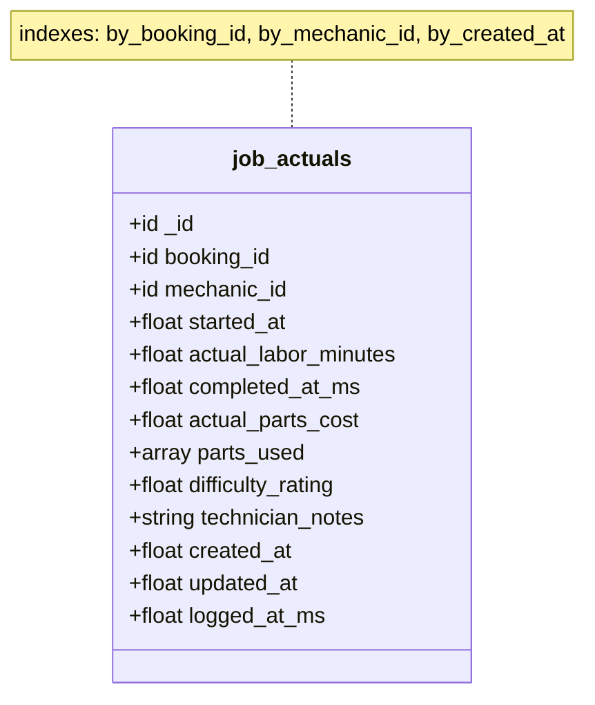

#### Table: `booking_status_history`

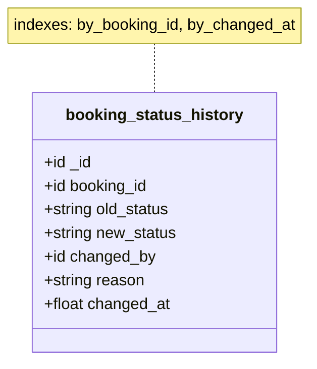

#### Table: `payment_status_history`

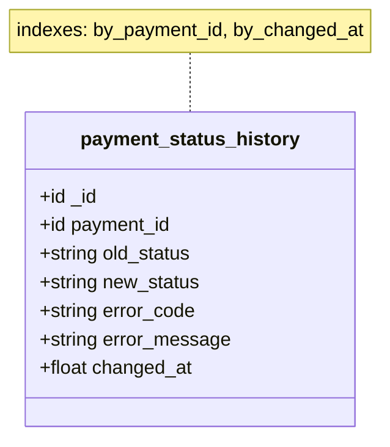

---

### Level 3 — Part 2: Vehicle catalog (one table per diagram)

#### Table: `makes`

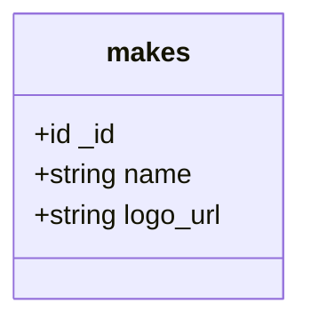

#### Table: `models`

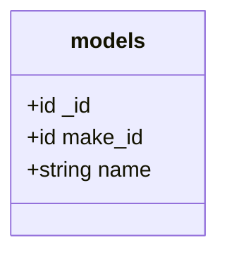

#### Table: `trims`

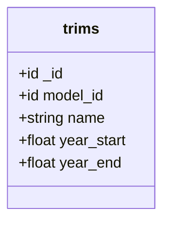

#### Table: `engines`

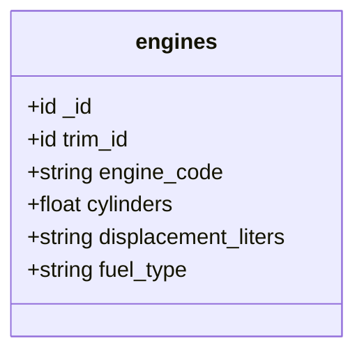

#### Table: `transmissions`

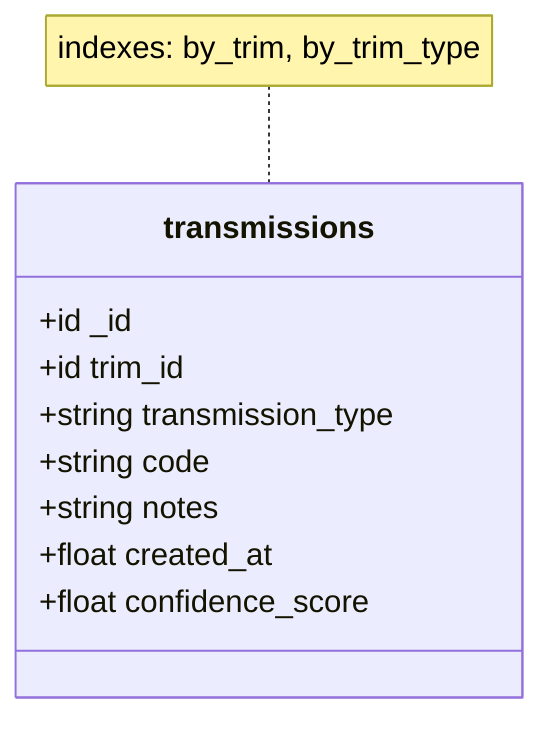

#### Table: `chassis_variants`

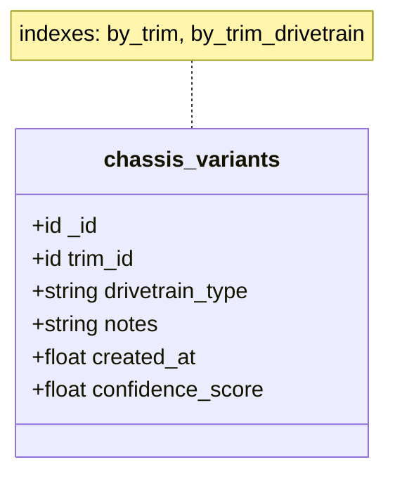

#### Table: `vehicles`

```mermaid
classDiagram
  class vehicles {
    +id _id
    +string vin
    +id trim_id
    +id engine_id
    +id transmission_id
    +id chassis_id
    +float year
    +object metadata
    +float created_at
    +float updated_at
  }
  note for vehicles "indexes: by_vin, by_engine_id, by_trim_id,\nby_transmission, by_chassis"
```

#### Table: `vehicle_owners`

```mermaid
classDiagram
  class vehicle_owners {
    +id _id
    +string vin
    +id user_id
    +string status
    +string nickname
    +boolean is_primary
    +float mileage
    +float added_at
    +float removed_at
  }
  note for vehicle_owners "indexes: by_vin, by_user_id,\nby_vin_user, by_user_status"
```

---

### Level 3 — Part 3: Vehicle intelligence (one table per diagram)

#### Table: `engine_specs`

```mermaid
classDiagram
  class engine_specs {
    +id _id
    +id engine_id
    +string oil_viscosity
    +float oil_capacity_qts
    +string coolant_type
    +float coolant_capacity_qts
    +string brake_fluid_type
    +string oil_change_interval
    +string cabin_air_filter_interval
    +string engine_air_filter_interval
    +string spark_plug_interval
    +string serpentine_belt_interval
    +string brake_fluid_interval
    +string coolant_interval
    +string transmission_fluid_interval
    +string tire_rotation_interval
    +float confidence_score
    +float created_at
  }
  note for engine_specs "indexes: by_engine"
```

#### Table: `vehicle_specs`

```mermaid
classDiagram
  class vehicle_specs {
    +id _id
    +id engine_id
    +string oil_viscocity
    +string oil_capacity_qts
    +string oil_filter_oem
    +string oil_drain_plug_gasket_oem
    +string front_brake_pad_oem
    +string rear_brake_pad_oem
    +string front_brake_rotor_oem
    +string rear_brake_rotor_oem
    +string parking_brake_type
    +string battery_group
    +float battery_cca
    +string engine_air_filter_oem
    +string cabin_air_filter_oem
    +string spark_plug_oem
    +float spark_plug_quantity
    +float spark_plug_gap_mm
    +string serpentine_belt_oem
  }
  note for vehicle_specs "indexes: by_engine_id; used by job_actuals for suggested parts"
```

#### Table: `transmission_specs`

```mermaid
classDiagram
  class transmission_specs {
    +id _id
    +id transmission_id
    +string transmission_fluid_type
    +float transmission_fluid_capacity_qts
    +string maintenance_interval
    +float confidence_score
    +float created_at
  }
  note for transmission_specs "indexes: by_transmission"
```

#### Table: `trim_specs`

```mermaid
classDiagram
  class trim_specs {
    +id _id
    +id trim_id
    +string tire_size_front
    +string tire_size_rear
    +float recommended_tire_pressure_front_psi
    +float recommended_tire_pressure_rear_psi
    +float lug_nut_torque_ft_lbs
    +float wiper_blade_driver_size_in
    +float wiper_blade_passenger_size_in
    +float wiper_blade_rear_size_in
    +string parking_brake_type
    +float confidence_score
    +float created_at
  }
  note for trim_specs "indexes: by_trim"
```

#### Table: `oem_parts`

```mermaid
classDiagram
  class oem_parts {
    +id _id
    +string oem_part_number
    +string name
    +string category
    +string notes
    +float created_at
  }
  note for oem_parts "indexes: by_part_number, by_category"
```

#### Table: `engine_part_fitments`

```mermaid
classDiagram
  class engine_part_fitments {
    +id _id
    +id engine_id
    +id part_id
    +string role
    +float quantity
    +float spark_plug_gap_mm
    +string notes
    +float confidence_score
    +float created_at
  }
  note for engine_part_fitments "indexes: by_engine, by_engine_role, by_part"
```

#### Table: `transmission_part_fitments`

```mermaid
classDiagram
  class transmission_part_fitments {
    +id _id
    +id transmission_id
    +id part_id
    +string role
    +float quantity
    +string notes
    +float confidence_score
    +float created_at
  }
  note for transmission_part_fitments "indexes: by_transmission, by_transmission_role, by_part"
```

#### Table: `trim_part_fitments`

```mermaid
classDiagram
  class trim_part_fitments {
    +id _id
    +id trim_id
    +id part_id
    +string role
    +float quantity
    +float wiper_size_in
    +string notes
    +float confidence_score
    +float created_at
  }
  note for trim_part_fitments "indexes: by_trim, by_trim_role, by_part"
```

---

### Level 3 — Part 4: Shops and services (one table per diagram)

#### Table: `shops`

```mermaid
classDiagram
  class shops {
    +id _id
    +string name
    +string slug
    +string address
    +string city
    +string state
    +string zip
    +float lat
    +float lng
    +string phone
    +float labor_rate
    +float rating
    +float review_count
    +boolean is_active
    +boolean is_verified
  }
```

#### Table: `mechanics`

```mermaid
classDiagram
  class mechanics {
    +id _id
    +id shop_id
    +string first_name
    +string last_name
    +boolean is_active
    +float rating
    +float review_count
  }
  note for mechanics "indexes: by_shop_id, by_is_active"
```

#### Table: `service_categories`

```mermaid
classDiagram
  class service_categories {
    +id _id
    +string name
    +string icon_name
    +float display_order
  }
```

#### Table: `services`

```mermaid
classDiagram
  class services {
    +id _id
    +id service_category_id
    +string name
    +string description
    +string slug
    +float default_labor_hours
    +boolean is_labor_only
    +boolean has_options
    +float display_order
  }
```

#### Table: `service_options`

```mermaid
classDiagram
  class service_options {
    +id _id
    +id service_id
    +string option_type
    +string option_label
    +float labor_hours
    +float parts_cost_low
    +float parts_cost_high
    +float state_fee
    +float display_order
  }
```

#### Table: `shop_services`

```mermaid
classDiagram
  class shop_services {
    +id _id
    +id shop_id
    +id service_id
    +boolean is_offered
  }
  note for shop_services "indexes: by_shop_id, by_service_id, by_shop_and_service"
```

#### Table: `shops_hours`

```mermaid
classDiagram
  class shops_hours {
    +id _id
    +id shop_id
    +string day_name
    +float day_of_week
    +boolean is_closed
    +string open_time
    +string close_time
  }
  note for shops_hours "indexes: by_shop_id"
```

#### Table: `time_slots`

```mermaid
classDiagram
  class time_slots {
    +id _id
    +id shop_id
    +id mechanic_id
    +string date
    +string start_time
    +string end_time
    +boolean is_available
  }
  note for time_slots "indexes: by_shop_id, by_mechanic_id,\nby_shop_and_date, by_availability"
```

#### Table: `service_vehicle_specs`

```mermaid
classDiagram
  class service_vehicle_specs {
    +id _id
    +id engine_id
    +id service_id
    +float labor_hours
    +float parts_cost_low
    +float parts_cost_high
    +float confidence_score
    +string tech_notes
  }
  note for service_vehicle_specs "indexes: by_engine_id, by_service_id, by_engine_and_service"
```

#### Table: `service_insights`

```mermaid
classDiagram
  class service_insights {
    +id _id
    +id engine_id
    +id service_id
    +float completed_jobs_count
    +float estimated_labor_hours
    +float avg_actual_labor_hours
    +float labor_variance
    +float avg_actual_parts_cost
    +float confidence_level
  }
  note for service_insights "indexes: by_engine_id, by_service_id, by_engine_and_service"
```

#### Table: `cdn_assets`

```mermaid
classDiagram
  class cdn_assets {
    +id _id
    +string url
    +string type
    +string caption
  }
  note for cdn_assets "Stores CDN/content URLs; referenced by shop_portfolio"
```

#### Table: `shop_portfolio`

```mermaid
classDiagram
  class shop_portfolio {
    +id _id
    +id shop_id
    +id content_id
    +float display_order
  }
  note for shop_portfolio "indexes: by_shop_id"
```

---

### Level 3 — Part 5: Reviews and follow-ups (one table per diagram)

#### Table: `reviews`

```mermaid
classDiagram
  class reviews {
    +id _id
    +id booking_id
    +id user_id
    +id shop_id
    +id mechanic_id
    +float rating
    +string comment
    +float created_at
  }
  note for reviews "indexes: by_booking_id, by_shop_id, by_mechanic_id, by_user_id, by_rating"
```

#### Table: `follow_ups`

```mermaid
classDiagram
  class follow_ups {
    +id _id
    +id user_id
    +string vin
    +id booking_id
    +id service_id
    +string follow_up_type
    +float scheduled_for
    +string status
    +string message
    +float created_at
    +float sent_at
  }
  note for follow_ups "indexes: by_user_id, by_vin,\nby_status_and_scheduled, by_booking_id"
```

---

### Level 3 — Part 6: User and onboarding (one table per diagram)

#### Table: `users`

```mermaid
classDiagram
  class users {
    +id _id
    +string clerkUserId
    +string email
    +string phone
    +string first_name
    +string last_name
    +string username
    +string alias
    +string profile_photo_url
    +float car_knowledge_level
    +array user_intentions
    +boolean onboardingCompleted
    +boolean tellUsAboutCompleted
    +string auth_provider
    +float createdAt
    +boolean emailConfirmed
    +boolean phoneVerified
  }
  note for users "indexes: by_clerkUserId, by_username"
```

#### Table: `onboarding_questions`

```mermaid
classDiagram
  class onboarding_questions {
    +id _id
    +string step_name
    +string question_text
    +string question_type
    +float rank
    +float display_order
    +boolean is_active
  }
  note for onboarding_questions "indexes: by_rank, by_step_name"
```

#### Table: `onboarding_question_answers`

```mermaid
classDiagram
  class onboarding_question_answers {
    +id _id
    +id question_id
    +string answer_text
    +string answer_value
    +float display_order
    +string emoji
  }
  note for onboarding_question_answers "indexes: by_question_id"
```

#### Table: `user_question_answers`

```mermaid
classDiagram
  class user_question_answers {
    +id _id
    +id user_id
    +id question_id
    +id answer_id
    +array answer_ids
    +string free_text_answer
    +float answered_at
  }
  note for user_question_answers "indexes: by_user_and_question, by_user_id"
```

---

### Level 3 — Part 7: AI and analytics (one table per diagram)

#### Table: `ai_conversations`

```mermaid
classDiagram
  class ai_conversations {
    +id _id
    +id user_id
    +string session_id
    +float started_at
    +float ended_at
    +string scenario_detected
    +float message_count
    +id booking_id
    +boolean led_to_booking
  }
  note for ai_conversations "indexes: by_user_id, by_session_id,\nby_booking_id, by_started_at"
```

#### Table: `ai_messages`

```mermaid
classDiagram
  class ai_messages {
    +id _id
    +id conversation_id
    +string role
    +string content
    +float timestamp
    +float confidence_score
    +object metadata
  }
  note for ai_messages "indexes: by_conversation_id, by_role, by_timestamp"
```

#### Table: `analytics_events`

```mermaid
classDiagram
  class analytics_events {
    +id _id
    +id user_id
    +string event_type
    +string event_category
    +object event_data
    +float timestamp
    +string session_id
  }
  note for analytics_events "indexes: by_user_id, by_event_type,\nby_event_category, by_timestamp, by_session_id"
```

#### Table: `conversion_funnels`

```mermaid
classDiagram
  class conversion_funnels {
    +id _id
    +id user_id
    +string funnel_type
    +string stage
    +id booking_id
    +float entered_at
    +float exited_at
    +boolean completed
    +string drop_off_reason
  }
  note for conversion_funnels "indexes: by_user_id, by_funnel_type,\nby_booking_id, by_stage, by_completed, by_entered_at"
```

---

### Level 3 — Part 8: Spec pipeline (one table per diagram)

#### Table: `ai_enrichment_logs`

```mermaid
classDiagram
  class ai_enrichment_logs {
    +id _id
    +id engine_id
    +id service_id
    +string source
    +float confidence_score
    +object enriched_data
    +float created_at
    +id reviewed_by
    +string review_status
  }
  note for ai_enrichment_logs "indexes: by_engine_id, by_review_status,\nby_confidence, by_created_at"
```

#### Table: `manual_review_queue`

```mermaid
classDiagram
  class manual_review_queue {
    +id _id
    +id enrichment_log_id
    +id engine_id
    +id service_id
    +string priority
    +string reason
    +string status
    +id assigned_to
    +float created_at
    +float resolved_at
  }
  note for manual_review_queue "indexes: by_status, by_engine_id,\nby_assigned_to, by_priority_and_status, by_created_at"
```

#### Table: `spec_variances`

```mermaid
classDiagram
  class spec_variances {
    +id _id
    +id job_actual_id
    +id engine_id
    +id service_id
    +float predicted_labor_hours
    +float actual_labor_hours
    +float predicted_parts_cost
    +float actual_parts_cost
    +float variance_percentage
    +boolean flagged_for_review
    +float reviewed_at
    +string notes
    +float created_at
  }
  note for spec_variances "indexes: by_engine_id, by_service_id,\nby_flagged, by_variance, by_job_actual_id, by_created_at"
```

#### Table: `spec_confirmations`

```mermaid
classDiagram
  class spec_confirmations {
    +id _id
    +id user_id
    +id engine_id
    +id service_id
    +id booking_id
    +boolean confirmed_accurate
    +string feedback
    +float confirmed_at
  }
  note for spec_confirmations "indexes: by_engine_id, by_user_id,\nby_booking_id, by_confirmed_at"
```

---

### Level 3: Function flows

#### Flow: Booking creation (`bookings.create` / `bookings.createBatch`)

**Single-service:** `bookings.create` – one booking with `service_ids: [service_id]`.

**Multi-service (app flow):** `bookings.createBatch` – one booking per appointment; accepts `services` payload (per-service labor_cost, parts_cost from **shop labor rate only**: labor_cost = shop.labor_rate × default_labor_hours, parts_cost = default_parts_estimate); optional `taxes_and_fees`, `platform_fee`; stores `service_ids` (array of IDs); total_cost = labor + parts + taxes_and_fees + platform_fee (full amount customer pays); initial status `pending`; marks one time slot unavailable; returns `[bookingId]`.

```mermaid
flowchart TD
  A[Client: create booking] --> B[bookings.create or createBatch]
  B --> C{Vehicle exists by VIN?}
  C -->|No| D[Throw: Vehicle not found]
  C -->|Yes| E{User owns vehicle?}
  E -->|No| F[Throw: User does not own this vehicle]
  E -->|Yes| G{Time slot available?}
  G -->|No| H[Throw: Time slot no longer available]
  G -->|Yes| I[Patch time_slots: is_available = false]
  I --> J[Insert one bookings row]
  J --> K[Insert booking_status_history]
  K --> L[Insert analytics_events]
  L --> M{Funnel ID provided?}
  M -->|Yes| N[Patch conversion_funnels: completed, stage]
  M -->|No| O[Return bookingId or array]
  N --> O
```

#### Flow: Booking status update (`bookings.updateStatus`)

```mermaid
flowchart TD
  A[Client: updateStatus] --> B[bookings.updateStatus]
  B --> C[Get booking]
  C --> D{Booking exists?}
  D -->|No| E[Throw: Booking not found]
  D -->|Yes| F[booking_status_history.validateTransition]
  F --> G{Valid transition?}
  G -->|No| H[Throw: invalid transition]
  G -->|Yes| I{Terminal state?}
  I -->|Yes| J[Throw: Cannot transition from terminal]
  I -->|No| K[Patch bookings: status, updated_at]
  K --> L[scheduler.runAfter: booking_status_history.log]
  L --> M[Return success]
```

#### Flow: Payment create and status update

```mermaid
flowchart TD
  subgraph create["payments.create"]
    A1[Client: create payment] --> A2[payments.create]
    A2 --> A3[Insert payments]
    A3 --> A4[Return paymentId]
  end
  subgraph update["payments.updateStatus"]
    B1[Client: updateStatus] --> B2[payments.updateStatus]
    B2 --> B3[Get payment]
    B3 --> B4{Valid FSM transition?}
    B4 -->|No| B5[Throw]
    B4 -->|Yes| B6[Patch payments: status, updated_at]
    B6 --> B7[scheduler: payment_status_history.log]
    B7 --> B8[Return success]
  end
```

#### Flow: Service vehicle specs lookup (car-specific pricing)

```mermaid
flowchart TD
  A[Client: getSpecsForEngineAndServices engineId, serviceIds] --> B[service_vehicle_specs.getSpecsForEngineAndServices]
  B --> C[For each serviceId: query by_engine_and_service index]
  C --> D{Spec found?}
  D -->|No| E[Use services.default_labor_hours + service_options fallback]
  D -->|Yes| F[Return labor_hours, parts_cost_avg per service]
  F --> G[ShopCard/Footer: price = labor_rate × labor_hours + parts]
  E --> G
```

Single-service lookup: `getByEngineAndService(engineId, serviceId)` returns one spec or null.

#### Flow: Job actuals prefill (suggested parts)

```mermaid
flowchart TD
  A[Client: getPrefillData bookingId] --> B[job_actuals.getPrefillData]
  B --> C[Get booking, vehicle, engine]
  C --> D[Query vehicle_specs by engine_id]
  D --> E[Lookup suggested parts by service slug]
  E --> F[Return vehicleLabel, serviceName, suggestedParts OEM numbers]
```

#### Flow: Time slot availability

```mermaid
flowchart TD
  A[Client: getByShopAndDate or getAvailableByShopId] --> B[time_slots query]
  B --> C[Filter: shop_id, date optional, is_available = true]
  C --> D[Return slots]
```

---

_Source: [convex/schema.ts](../convex/schema.ts). Convex modules: [bookings](../convex/bookings.ts), [payments](../convex/payments.ts), [job_actuals](../convex/job_actuals.ts), [service_vehicle_specs](../convex/service_vehicle_specs.ts), [time_slots](../convex/time_slots.ts), [booking_status_history](../convex/booking_status_history.ts), [vehicle_specs](../convex/vehicle_specs.ts)._
